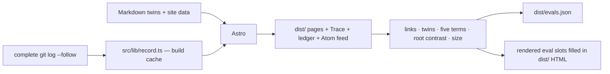

# civic.ai — Design Charter

This document is the design north star for **civic.ai**. It binds visual language, interaction, and information architecture, and it describes the site as built. Proposals that have not shipped are collected in §21 rather than mixed into the description, so every other sentence here can be checked against the live pages. Where the build and this charter disagree, one of them is wrong: fix whichever it is, in the same change. Build mechanics stay in [AGENTS.md](AGENTS.md); content conventions stay in [README.md](README.md).

The charter's test for every element on every page is the book's own test for a pack name: **if it does not change who can object, who must answer, what gets logged, or what happens after failure, it is decoration.**

---

## 1. North star

> The site is the first exhibit. It must be governed the way it asks AI to be governed.

civic.ai argues that legitimacy comes from institutions that show their work, answer to the people they affect, repair in public, and stay sunset-ready. Nearly every site on the internet — including most sites about AI ethics — fails that test. This one must pass it, visibly.

So the design brief is not "make a beautiful book site." It is: **make the first website that runs its own 6-Pack of Care, and let every aesthetic choice fall out of that.** The beauty is a consequence of the honesty, the way a well-kept ledger or a well-worn tool is beautiful.

Three phrases from the project's own vocabulary anchor everything below:

- **"Governance should feel like a daily capability"** → the care cycle is drawn as a loop a reader can follow (§10, the Measures map), and the site keeps one structure from Daylight to Lantern (§13).
- **"Many local guardians rather than one central watchtower"** → the identity mark is an open ring with an empty centre.
- **"Data is soil, not oil"** → the material world of the design is soil, field, moss, harvest, cinnabar — not chrome, gradients, or "tech."

## 2. Who it serves

| Audience                        | Their job here                                  | Design consequence                                                        |
| ------------------------------- | ----------------------------------------------- | ------------------------------------------------------------------------- |
| Policy & governance people      | Cite it, brief a minister, draft a clause       | Paragraph-numbered public-record pages; print that survives a photocopier |
| Builders & engineers            | Implement a pack; run a Kami                    | Defined headline measures; copyable terminal blocks; the machine door     |
| Civic & community practitioners | Convince a room; run a process                  | Comics, audio, plain-language "gist" cards, reading paths                 |
| Carers and older readers        | Read comfortably; feel respected                | 18 px+ body type, high contrast, obvious controls, no tricks              |
| Mandarin readers (zh-Hant)      | A first-class edition, not a translation ghetto | Twin pages with equal typographic dignity; Han-first display type         |
| AI agents ("claws")             | Bootstrap as a Kami; quote faithfully           | OpenClaw well-known surface, llms.txt, JSON-LD, citable ¶ anchors         |

The core record has English and Traditional Mandarin twins. The comics also have a Japanese reading edition, with its own text overlays and three-way language declarations. The zh-Hant edition is never a re-skin of the English page; both are twins of one underlying record.

## 3. The argument, restated as design

Each pack becomes a standing behaviour of the site itself. This table is the charter's spine; every section that follows implements a row of it.

| Pack                     | The site's obligation                                                                                                                 | Mechanism                                                                                                                                                                  |
| ------------------------ | ------------------------------------------------------------------------------------------------------------------------------------- | -------------------------------------------------------------------------------------------------------------------------------------------------------------------------- |
| 1・Attentiveness 覺察力  | Every page listens. Disagreement has a door on every page, and missing voices are invited, not just tolerated.                        | "Contest this page" route in the Trace; bilingual door in the masthead; a11y as listening                                                                                  |
| 2・Responsibility 負責力 | Every page is signed. Named stewards, named illustrator, named contributors — a human answers for every claim.                        | The steward line in the Trace; source and commit-log authorship surfaced, not buried                                                                                       |
| 3・Competence 勝任力     | The site publishes its own evals. The checks that already run in private (links, parity, terminology, contrast) become public.        | The eval board in the Trace, fed by the final build pass; failures shown amber, never hidden                                                                               |
| 4・Responsiveness 回應力 | Every page shows its amendment history and what changed after someone objected.                                                       | Per-page amendment count + ledger link, derived from git; the `/ledger/` page                                                                                              |
| 5・Solidarity 團結力     | Nothing locks anyone in.                                                                                                              | CC0, self-hosted fonts and shell assets, readable without JavaScript, exportable and syndicated; hosted video and the optional Ask service are explicit network exceptions |
| 6・Symbiosis 共生力      | The site stays bounded and sunset-ready. No engagement mechanics, no growth loops, and an honest handover plan when its work is done. | Refusals list; a succession line in every colophon naming who keeps the record and how anyone can continue it; the machine door for symbiosis with agents                  |

This is the "insanely great" move: no other site can copy it without also adopting the ethics. The design cannot be stolen as a skin.

## 4. Identity

### 4.1 Name

The wordmark is bilingual and equal: **civic.ai・仁工智慧**. On EN pages English leads; on zh pages 仁工智慧 leads. Neither is a subtitle of the other.

### 4.2 The Ring of Six

The identity mark is an **open ring with an empty centre** — the letterhead **bug**: one stroke circle plus the open arc (no fill in the middle). The centre is the room where the community sits; no system occupies it. Many local guardians, no central watchtower.

- **Shipped surfaces:** favicon, interior masthead wordmark (`CivicBug`), the Trace's disclosure handle (§8), and letterhead lockups use this same geometry (harvest gold on night field at favicon size; `currentColor` in the masthead).
- **The Measures map** keeps the **six pack hues** as wayfinding only: a coloured top rule on each pack's card, and a small dot beside a pack named in a relation. They never colour text, and they are not a second logo.
- The dot in the wordmark "civic.ai" is the ring at small size (the bug beside the bilingual name).

### 4.3 The site-mark as the record's handle

The Trace (§8) uses the site-mark as its disclosure handle, once per page, at the foot. No 仁 seal appears; responsibility is carried by the named stewards and the public record. The mark never decorates. Red used anywhere must justify itself against §5.4.

### 4.4 Partner marks

Oxford Institute for Ethics in AI and Accelerator Fellowship Programme marks are treated by page role. **The home/index page keeps the current Oxford-blue institutional masthead**: it is the doorway from the AFP world into civic.ai, and the original reversed lockups are correct there. It closes with an Oxford-blue institutional footer in both themes. Interior pages close with a self-contained **partner colophon** on `--surface`, with a hairline box, 4 px corners and an Oxford provenance rule — the way a university press signs a book's spine rather than its every page. **Asset rule:** the reversed (white on navy) `oxford-logo.svg`/`afp-logo.svg` lockups belong to the home masthead only. The colophon uses dedicated light-background marks in Daylight; Lantern adjusts those marks with CSS filters. If institutional agreements require header presence beyond the home page, the interior masthead carries a single-line text credit instead of logo images.

## 5. Colour — "Soil & Daylight"

### 5.1 Intent

The palette comes from the project's own materials: field soil, rice paper, moss, harvest grain, cinnabar paste. It is explicitly **not** the AI-default cream-and-terracotta editorial palette: the ground is cast toward green-grey (field light), never yellow-pink (latte); the red is functional, never an accent sprinkled on headings. Harvest marks glossed terms, small labels, fine rules and the site-mark. Cinnabar marks contest actions; failed evaluations use amber.

### 5.2 Core tokens (Daylight theme)

| Token        | Name        | Hex       | Role                                                                                   |
| ------------ | ----------- | --------- | -------------------------------------------------------------------------------------- |
| `--field`    | 田 Field    | `#F2F1E8` | Page ground — warm paper with a green-grey cast                                        |
| `--surface`  | 紙 Paper    | `#FBFAF4` | Raised cards, gist blocks                                                              |
| `--ink`      | 墨 Ink      | `#211D16` | Primary text — warm soil-black, not asphalt                                            |
| `--soil`     | 壤 Soil     | `#5A5142` | Secondary text, captions                                                               |
| `--moss`     | 苔 Moss     | `#33603E` | Links and interactive affordances (underlined in prose)                                |
| `--cinnabar` | 硃 Cinnabar | `#B4351F` | Contest actions — functional red only                                                  |
| `--harvest`  | 穗 Harvest  | `#7A6128` | Gloss marks, small labels, fine rules and the site-mark                                |
| `--rule`     | 界 Boundary | `#DDD9CB` | Hairlines in machinery zones                                                           |
| `--oxford`   | 紋 Oxford   | `#002147` | Institutional provenance — home masthead and footer, interior frame rules, formal CTAs |

Failed evals use a separate amber treatment in each theme. Harvest was darkened from its first value (`#96762F`) so small labels clear AA on both grounds. All text/ground pairs must clear WCAG 2.2 AA; the contrast eval (§8) checks the root pairs in both themes.

### 5.3 The six pack hues — inherited from the comics

The canonical pack colours come from the 6-Pack comics. They outrank the earlier day-cycle draft colours because readers already learn the packs through this code. On the Measures map, pack cards sit on `--surface` like any other card in either theme; the hue stays in the card's top rule.

| Pack | Comic colour          | Hex       | Use                      |
| ---- | --------------------- | --------- | ------------------------ |
| 1    | Red/Attentiveness     | `#EB573A` | Noticing and contest     |
| 2    | Orange/Responsibility | `#F09344` | Ownership and promises   |
| 3    | Yellow/Competence     | `#F9DD55` | Execution and capability |
| 4    | Green/Responsiveness  | `#7CC967` | Repair and response      |
| 5    | Blue/Solidarity       | `#6197F8` | Cross-group cooperation  |
| 6    | Purple/Symbiosis      | `#A753F6` | Boundary and handoff     |

Usage is strict: pack hues are wayfinding only. On pack pages they colour h2 rules, gist-card keels, the eyebrow mark, tool-card keels and wide-screen TOC rails; on the Measures map, card top rules, relation dots and the Pack 6 outline, and below it the instrument-card keels. Never body text, never backgrounds behind prose, never the page frame. The pack-page rules use contrast-tuned variants: Packs 3 and 4 darken in Daylight (`#D4B21C`, `#5FAE4A`), and Pack 6 lightens in Lantern (`#B98CF9`). **Oxford blue is not retired; it is constrained.** It frames institutional provenance: the home masthead and footer, the interior masthead and colophon rules, formal provenance links, and at most one primary institutional CTA. Pages stay one family; hue is wayfinding, Oxford blue is provenance, neither becomes a theme.

### 5.4 Rules

- Cinnabar is reserved for actions that genuinely contest or warn. Zero is common. The Trace has no red seal.
- No gradients. Light in this design comes from paper and (in Lantern mode) from glow, never from a `linear-gradient` sky.
- No pure black, no pure white anywhere.
- The AFP teal→blue gradient is allowed only inside the official reversed masthead lockup on the home page. It is not a site accent and does not appear in interior chrome.

## 6. Type — "Two Voices"

### 6.1 Intent

The book's thesis is a pairing: human deliberation plus inspectable machinery. The typography encodes exactly that, and nothing else:

- **The human voice** — everything argued, narrated, or spoken — is set in serif.
- **The machinery voice** — everything logged, measured, checked, or executable — is set in mono, and never lies about being machinery.

There is no third voice. UI chrome (nav, labels, buttons) borrows the machinery voice at small sizes, because navigation is honest plumbing.

### 6.2 Faces

| Role             | Latin              | Han (zh-Hant)                                 | Notes                                                                                      |
| ---------------- | ------------------ | --------------------------------------------- | ------------------------------------------------------------------------------------------ |
| Display & prose  | **Literata**       | **Noto Serif TC**, subset per page            | Self-hosted WOFF2 with swap; Latin has a metric-adjusted local fallback                    |
| Machinery        | **IBM Plex Mono**  | System sans fallback                          | Noto Sans TC is named in the fallback stack but is not shipped                             |
| Chinese emphasis | Literata for Latin | **Civic Kai**, local Han-only face            | Used for emphasis and quotations; falls back to prose where no local Kai face is available |
| Japanese comics  | —                  | Mochiy Pop One, Noto Sans JP, Zen Maru Gothic | Self-hosted subsets for the Japanese overlays                                              |
| Tibetan          | —                  | **Monlam Bodyig** (self-hosted)               | Keep; it is a solidarity statement in font form                                            |

**jf 蘭陽明體 (LanYang Ming) is image-only.** There is no web-embedding licence, and none is coming: it must never ship as a webfont, a subset, or outlined SVG text. Where its voice is wanted — the bilingual wordmark lockup, title plates inside illustrations — it is pre-rendered offline into PNG, the same workflow already used for illustration, with the full text carried in `alt`. Live DOM prose in zh-Hant is Noto Serif TC, with Civic Kai for emphasis and quotations; it is the shipped face, not a placeholder.

Downloaded fonts are self-hosted subsets with `font-display: swap`; Civic Kai and the system fallbacks are local faces. No CDN fonts, ever (§3, Pack 5).

### 6.3 Scale and rhythm

- Body: main prose is `1.125rem` (18 px at the usual 16 px root; older readers are a named audience, §2), in a responsive column capped at 680 px including padding (32 px side padding, 20 px below 720 px).
- Headings: interior h1 is 1.6 rem below 720 px and otherwise clamps from 1.8 to 2.6 rem; the home title clamps from 2.2 to 3.4 rem.
- Leading: English prose 1.65; Chinese prose 1.9. The `--measure-*` and `--leading-*` tokens remain reference values rather than column constraints (Appendix A).
- Headings: Literata 500–600, tight tracking; never all-caps in the human voice. Machinery labels may letterspace lowercase or use caps at ≤ 0.75 rem.

### 6.4 Bilingual mechanics

- Pangu spacing between Han and Latin/digits is applied by the formatter (`pangu-format.mjs`) and checked by lint; the build consumes the authored spacing. The design treats that spacing as kerning, not decoration.
- zh punctuation: full-width; quote 「」 styling per house rules; `——` set solid. Chinese prose uses strict line breaking and tuned leading.
- The build labels mixed-language runs. On Mandarin pages each run of Latin script — two letters or more, with joined words, `16 GB` and `GPT-4` counted whole — is wrapped in `lang="en-GB"`; on English pages each Han run is wrapped in `lang="zh-TW"`. The correct face, hyphenation and line-breaking then apply, and screen readers switch voice. Only text inside prose elements is touched; code and anything already carrying `lang` are skipped, a locked mixed-script label such as 地神（Kami） is never split, and ids, links and attributes stay byte-identical.
- Mandarin prose sets `hanging-punctuation: allow-end first last` where the browser supports it, `text-autospace: normal` so a Han–Latin gap appears where no space is authored (authored Pangu spacing is not doubled), and `text-spacing-trim: trim-start` so a line-opening bracket sits flush with the column.
- The masthead links to the declared twin with "華文" or "English" — a twin-page link, not a flag icon. Pages without a twin omit the control. Following it carries the reading position across: the twin opens at the same heading and the same distance into that section when the two pages' headings correspond, otherwise at the same ¶ unit, otherwise at the same fraction of the page. The position travels in `sessionStorage` for five minutes and only for a plain click on the link; without JavaScript, or when the twin's URL carries a `#`, the twin opens at its declared URL.

## 7. Space & structure

### 7.1 Page anatomy

One anatomy serves every page; blueprints (§10) vary the organs, not the skeleton.

```
┌──────────────────────────────────────────────────────────────┐
│ masthead   wordmark            lang · theme · search tools   │
│ nav        text navigation                                   │
├──────────────Oxford-blue provenance rule (2px)───────────────┤
│                                                              │
│   title    Responsiveness                                    │
│   byline   date · author · description                       │
│   gist     [In short: summary]                               │
│                                                              │
│ ┌─────────┐ ┌──────────────────────────────┐                 │
│ │ TOC     │ │ prose column (<= 680 px)     │  ¶ 12           │
│ │ left    │ │ text...                      │  right          │
│ │ rail    │ │                              │  margin         │
│ │ 1280px+ │ │ [machinery block: squared]   │  1200px+        │
│ └─────────┘ └──────────────────────────────┘                 │
│                                                              │
│   chapter nav   <- Pack 3 title          Pack 5 title ->     │
├──────────────────────────────────────────────────────────────┤
│ site-mark · The Trace · Amended YYYY-MM-DD  (closed, §8)     │
├──────────────────────────────────────────────────────────────┤
│ partner colophon  ·  Oxford / AFP marks                      │
└──────────────────────────────────────────────────────────────┘
```

- **Masthead**: the interior masthead carries the bilingual wordmark and the language, theme and search tools, followed by text navigation and a 2 px Oxford-blue provenance rule that matches the colophon rule below. No banner, no hero-blue slab. The institutional header is retained **only on the home/index page** as the Oxford/AFP doorway; interior pages open with the reader's content.
- **Rails**: eligible long pages put their generated TOC in the left rail from 1280 px; core-record paragraph links occupy the right margin from 1200 px, and from 1360 px gloss and footnote side-notes sit beside them (§11.5, §11.10). The Trace lives only at the foot of the page.
- **Prose zones** are soft: generous white, 4 px radii on cards, and prose stays unboxed. A bold-opening paragraph or loose bullet starts a new unit with a hairline and air above; directly beneath a heading, the heading supplies the separation.
- **Machinery zones** are squared: 0 radius, hairline `--rule` borders, mono type. A reader can tell from across the room which parts of the page are argument and which are record.

### 7.2 Paragraph numbers

Core-record pages (manifesto, packs 1–6, measures, FAQ) carry gazette-style paragraph numbers: `¶ 14`, each an anchor (`#p14`). Markdown prose paragraphs and text-bearing list items share one sequence, nested bullets included; quoted and empty bullets, raw-HTML prose, footnotes and image-only blocks are excluded. Numbers survive edits. A committed ledger, `_data/anchors.json`, remembers each unit by its normalised text. On every build a page's units are aligned with its ledger in order — exact text first, then rewording at a similarity of 0.6 or more — so a reworded paragraph keeps its number, an inserted one takes a letter in the preceding number's family (`¶ 2a` after `¶ 2`; `¶ 0a` before the first), and a deleted one's number is retired and never reused. `bun run anchors -- --write` records the ledger after a core-record page changes, and `--check` reports any page whose ledger is stale. Policy people cite paragraphs; scholars deep-link them; agents quote them, and a citation keeps pointing at the same words. Numbers are machinery voice, soil-coloured; below 1200 px a number appears on hover, keyboard focus or direct targeting, and above it the numbers stay visible in the right margin.

## 8. The signature — The Trace 紀錄

One place gets all the boldness. Each site page closes with a folded public record. Its summary shows the site-mark, "The Trace" or "紀錄", and the last amendment's ISO date where available; opening it reveals the rest. Nothing on the site is more memorable than this, by design.

```
─────────────────────────────────────────────────────────────────────
 (site-mark)  The Trace   Amended 2026-09-30                  closed
─────────────────────────────────────────────────────────────────────
 opened:
 STEWARDS   Audrey Tang · Caroline Green
 AMENDED    30 Sep 2026 · 214 recorded amendments since Mar 2026
            → Full amendment ledger  /ledger/
 SOURCE     1.md · CC0 public domain · edit on GitHub
 EVALS      links ✓   parity ✓   terms ✓   contrast ✓   size ✓
 CONTEST    Disagree? File an amendment · write to the stewards · Polis
 TWIN       華文版本 /tw/1/ — same record, same receipts
─────────────────────────────────────────────────────────────────────
```

Rules and sources:

- **The handle** — the site-mark turns half a revolution as the disclosure opens (§12). The summary carries no prefix and no seal.
- **Stewards** — from front matter. This is Pack 2 made visible: a name means someone answers.
- **Amended** — dates and count derive from complete git history across the page's contributing sources. The count includes first publication and deduplicates shared commits. When history is unavailable, dates and counts are omitted with an explanation, and the ledger link remains. Pack 4: the page admits it has changed and shows where to see how.
- **Evals** — the final build pass publishes site-wide outcomes: links, twin declarations (pairing and reciprocal `hreflang`), five locked glossary terms, root-token contrast and measured page weight, with full receipts at `/evals.json`. Until that pass fills them, eval slots render nothing. These checks state their scope; they do not certify translation fidelity or whole-page accessibility. **A failing check ships amber and honest ("terms ⚠ needs repair"), never hidden and never blocking publication** — that is the difference between an eval and a gate, and the site must model it. Pack 3.
- **Contest** — the contest link opens a GitHub issue with the page URL in its title, alongside the stewards' address and a live Polis conversation where one is identified. Paragraph references are supplied by the reader. Pack 1: disagreement has a door on every page.
- **Twin** — the parity statement, naming the sibling page. Pack 5.

The Trace prints (§17) as a boxed colophon, so even the photocopied page shows its work.

## 9. Wayfinding

Navigation across the core follows the care cycle in order.

- The masthead uses text navigation (§7.1).
- Chapter navigation follows Packs 1–6, then Measures and FAQ, using destination titles. Pages may override the sequence in front matter. Pack 4, where the care cycle closes, offers Pack 5 and a second, dashed link home: `↺ Back to Pack 1: Attentiveness`. Pack 6's onward step is Measures — the cycle resolves into instruments.
- **Reading paths** (`_data/paths.json`): the home page offers five three-stop paths — everyday conversations, care and frontline work, policy and governance, builders and engineers, and civic and community practice. Each path is a labelled list of links.

## 10. Page blueprints

Every page keeps the shared anatomy (§7.1). Distinctive organs only, per page:

- **Home** — The one page with an institutional doorway. It keeps the current Oxford-blue masthead and reversed Oxford/AFP lockups, echoing the AFP site rather than pretending civic.ai has no institutional home. Behind that masthead about 120 faint lights drift almost imperceptibly; without JavaScript or under reduced motion they stand still (§12). Below that, the page becomes civic.ai: the thesis line — _"Civic AI is artificial intelligence that answers to the people it affects."_ — and Nicky Case's overview page as a framed plate ("the argument, drawn"), not as wallpaper. Then a three-step starting sequence, listening and viewing links, the five reading paths, a text-card pack index, four ways into the practice (each with its own evidential status, not four interchangeable proofs), publications and the project stewards. The page closes with the Oxford-blue institutional footer.
- **Pack pages (1–6)** — Each pack opens with a bilingual eyebrow in the machinery voice — pack number and the pack's name in the other language (`Pack 4 · 回應力`/`第四力 · Responsiveness`) — beside a short pack-hue mark; then the shared title block, the pack's governing question as a standfirst under the title, and its gist card; then the first comic plate and prose. The second comic appears later in the chapter. The first plate loads eagerly at high priority, with native AVIF selection where a sibling asset exists. Buildable tools are machinery cards: squared and hairline-bordered on `--surface`, with a 4 px pack-hue keel, the tool's bold lead-in as the card title in the machinery voice and its ¶ link kept inside the card; one column on phones, two on wide screens. Chapter nav at the foot (§9).
- **Measures** — The instrument room. After the map, each headline measure is an instrument card: squared, with its pack's hue as the keel, the measure's own paragraph unchanged, then a short specification in the machinery voice — the measure's name in the other language, its supporting diagnostics, what it refuses to reward, its threshold and how to read it. Every value is quoted from the page's own words; the page states no refresh cadence or intended reader, so the cards show none. Each of the eleven named instruments carries an anchor matching its glossary id (`#shadow-mode`, `#brake`, …).
- **Manifesto** — The document. Widest margins, ¶ numbers, a provenance line up top ("As delivered; the spoken record — vocabulary is not normalised to later usage"), audio where narration exists (§11.6), print-first quality (§17). No gist card; a manifesto is not summarised above its own first line.
- **FAQ** — The public hearing. Category pills filter the questions as an enhancement; search is the shared masthead overlay (§11.9). Questions keep their `#faq-N` links, with ordinal citations on answer prose. Each question has a squared link-icon button ("Copy link to this question") that turns into a check and politely announces "Copied", and its answer is wrapped as `#faq-N-answer`. Below 720 px the answers fold behind their questions as disclosure buttons, so a phone shows the questions first; from 720 px, and always without JavaScript, every answer is open.
- **Glossary** — The terms canon. Each entry pairs the edition's locked term with the locked term in the other language beside it (`lang`-tagged, in the machinery voice), then gives the definition in the edition's language — the visible tip of the terminology eval, which reads the label from the paired entry. First-use glossing links each term to its entry (§11.5).
- **Essays & transcripts** — Speaker turns keep their authored bold lead-ins and the shared hairline separation on screen (§7.1). Pages marked `transcript-page` receive dedicated transcript printing, including small machinery labels and turn spacing; the class is applied explicitly rather than inferred from dialogue content. Timestamps, where present, are mono and soil-quiet. Dialogue pages state their nature up top: spoken record vs written essay.
- **Comics** — The gallery. Each Nicky Case page in a plate frame on `--surface` with its full alt text as an honest caption toggle. Hand-drawn warmth is this site's only illustration language; nothing generated, nothing stock (§18).
- **Conference & sensemaker** — The data room. The conference keeps its own layout. The deliberation mirror combines prose headings with machinery figures and rounded inspection cards. The English sensemaker remains a standalone report, with the shared public record and partner colophon appended.
- **Map & Measures (`/measures/#map`) — the framework map** _(merged before publication)_. The map is the framework index at the top of Measures, not a metric illustration, and it is drawn in words rather than geometry. It reads top to bottom in three zones. The care cycle (Packs 1–4) is a loop of cards, with what each pack hands the next written on the arrow between them; on phones it becomes a sequence that ends “back to Pack 1”. The field between organisations (Pack 5) lists what it receives from the cycle. Pack 6, the boundary in time, draws the purple outline that frames the whole map, and its card says in words what crosses the boundary in each direction. Every relation appears once, on the card that owns it. Pack names open their chapters beside the map; each card's headline measure lands on its audit row below. The page then continues into the headline measures, diagnostics, named instruments, refusal clauses, and readiness gates.
- **Kami setup (`/kami/`)** — The workshop. Three numbered steps (a true sequence, so numbers are earned), terminal copy-boxes, and guidance on memory, checks, keeping and retirement. It closes with "Your Kami's own trace": a squared machinery record, captioned as a worked example for a fictional community pantry, of what a room's deployment should log from day one — keepers and successor, scope, memory files, dated checks, overrides and what changed, how to contest, and when it is reviewed or ends.
- **OpenClaw (`/openclaw/`)** — The machine door. It addresses agents directly in the shared prose layout, with machinery type for executable material and links to the plain-Markdown bootstrap skill at `/.well-known/openclaw/SKILL.md`. The homepage's agent-note ribbon stays — a site that expects non-human readers should say so where humans can see it too.
- **Ledger (`/ledger/`)** — The site's own amendment record, generated from git at build: grouped by month, each entry `date · page · summary`, plus the eval board for the whole site. It is navigable by month rather than indexed for search as authored prose. This is the override ledger applied to ourselves.
- **404** — "This path has been sunset." The shared shell and a bilingual explanation, with direct routes to Home, FAQ and Glossary; search remains available from the masthead. Even the dead end states the thesis.

## 11. Component language

1. **Gist card** (evolves `in-short`): `--surface` card, 4 px radius, "In short/簡單講" label in machinery voice, reading time. Unchanged in role; retyped and re-grounded.
2. **Links**: prose links are moss and underlined (`text-underline-offset: 3px`), with a visited cue (long documents deserve one) and a small machinery-voiced ↗ on external links. Navigation, card links and institutional bands use their own legible link treatment.
3. **Buttons**: primary reading actions ("Read the manifesto") are outlined, lightly rounded links in the machinery voice. Copy buttons are squared; category filters are pills in a flush bar; contest actions remain underlined text links. Never a gradient, never a shadowed CTA.
4. **Quotes**: pull quotes get a pack-hue rule and Literata italic at display size, reserved for genuinely load-bearing lines (≤ 1 per page). Prose blockquotes use soil text and a harvest rule; Chinese quotations use the local Han-only Kai face. On paper, the quotation rule is Oxford blue.
5. **Gloss links**: first-use glossing adds a harvest dotted-underlined link from a term's first appearance to its local glossary entry, matching terms, aliases and IDs. This turns the locked terminology canon into visible craft. On screens 1360 px and wider each glossed term also gets a side-note in the right margin, aligned with its line: the term as this edition names it, the first sentence of its definition and "Full entry →". Notes stack so none overlap and stay clear of the ¶ numbers; the layer switches itself off beside full-bleed figures. Narrower screens open the same note as a popover on tap or Enter — a labelled dialog with a close button, dismissed by Escape or an outside tap, returning focus to the term. Definitions come from `/glossary-notes.json`, same-origin, fetched after load when the browser is idle and only on pages that have glossed terms.
6. **Audio — the walking player**: narrated pages keep the native `<audio>` in the content column, which is what a reader without JavaScript gets, and lay one player over it: play/pause, ±30 s, a speed control stepping from 0.75× to 2×, a seek bar and elapsed-of-total in the machinery voice, all labelled in the page's language. From 1280 px it docks at the foot of the contents rail, sized to stay on screen; below that it stays in the column and, while playing, becomes a slim bar at the foot of the screen once its place has scrolled away. Each page remembers its own position (`localStorage`, on this device only) and resumes there. The narrations are synthesised in Audrey's own AI voice with ElevenLabs eleven_v4 (`scripts/tts_synth.py --model eleven_v4`) and loudness-normalised to −16 LUFS; the current recordings were checked against the current text with chunked speech recognition (about 3% word error, no passage missing or added).
7. **Tables**: prose tables stay bookish (hairline rows, no zebra). Anything that _is_ a record — measures, eval boards, ledgers — renders as machinery: squared, mono figures, tabular-nums.
8. **Terminal copy-boxes**: keep the existing component; restyle to machinery (squared, `--rule` border, mono, Copy button squared).
9. **Search**: search lives in the shared masthead overlay. English uses Pagefind in production; Traditional Mandarin uses a local Fuse index (as does English in development). Bundles and search styling load on first search intent — the search button or Cmd/Ctrl-K, which is then replayed — not on the reading path.
10. **Footnotes**: Markdown footnotes keep the standard endnote rendering, which is what prints and what a reader without JavaScript gets. On screens 1360 px and wider each footnote also appears as a margin note aligned with its reference, sharing the gloss notes' layout; narrower screens open it as a disclosure directly under its paragraph, with a link on to the endnote — the reader is never sent to the basement and abandoned.

## 12. Motion

Motion is small, and it only confirms something the reader did or marks arrival; everything else is a ≤ 200 ms colour/underline transition.

1. **The record opens**: the Trace's site-mark turns half a revolution over 200 ms as its disclosure opens.
2. **Arrival**: headings have a short arrival treatment on page load.
3. **Hover**: portraits and cards have restrained hover movement.
4. **The constellation**: on the home page the field of lights drifts by a few pixels over 90 seconds.

`prefers-reduced-motion: reduce` removes smooth scrolling and shortens animation and transition durations; the Trace still indicates its open state by orientation, and the constellation stays still. Nothing on the site ever moves to attract attention.

## 13. Lantern mode

Dark mode is thematically earned — dusk is when the guardians' lanterns come on — but it must not collapse into the AI-default near-black-plus-acid-accent look.

| Token        | Name         | Hex       |
| ------------ | ------------ | --------- |
| `--field`    | 夜 Night     | `#191C22` |
| `--surface`  | 幕 Dusk      | `#20242C` |
| `--ink`      | 米 Rice      | `#EAE4D4` |
| `--soil`     | 灰 Ash       | `#A89F8D` |
| `--moss`     | 苔 Moss      | `#8FB79A` |
| `--cinnabar` | 燈硃 Lantern | `#E06844` |
| `--harvest`  | 燭 Candle    | `#C8A25C` |

Warm lights on indigo-charcoal. The dark block also sets `--rule: #343945` and a lighter `--oxford-rule: #5B7CB2`; pack-rule adjustments are selective (§5.3). Lantern keeps the same page structure and changes its light. The masthead toggle remembers the reader's choice locally; otherwise the pre-paint boot script follows `prefers-color-scheme`. Without JavaScript, the page uses Daylight.

## 14. Access is care

Accessibility is Pack 1 applied to the reader: attention to the quietest users, as architecture rather than remediation.

- WCAG 2.2 AA is the target. The public contrast eval checks selected root text/ground pairs in both themes and is displayed in the Trace; whole-page accessibility, 200 % zoom and 320 px layout need separate browser checks.
- Body ≥ 18 px; all type in `rem`; layout must survive 200 % zoom and 320 px viewports without horizontal scroll.
- Visible focus everywhere: a 2 px moss outline, normally at 3 px offset. Selected shell and search controls use 2 px; the Trace summary places its outline inside the handle. Contest text is cinnabar, but its focus outline remains moss.
- Full keyboard paths, skip-link (exists — keep), `aria-pressed` on filters (exists — keep), `lang` on mixed-language runs, added at build (§6.4).
- Reading without JavaScript is complete: glossing and margin notes, TOC, filters, FAQ folding, reading-position transfer and search are enhancements atop a full plain-HTML page. Authored content images become native picture elements at build, with AVIF renditions where available and a JPEG or PNG fallback; images remain visible without JavaScript and need no client-side swap.
- Alt text remains long-form and faithful (the comics' alt text is already exemplary; it is a design asset, not a chore).
- Both languages get equal a11y: skip-links and labels localised, zh line-length and leading tuned for readability, not squeezed into Latin metrics.

## 15. Weight budget

Solidarity includes readers on old phones and thin connections. Budgets are targets reported per page by the final build pass (part of the eval board), not publication gates:

| Resource                             | Target                                                                                                     |
| ------------------------------------ | ---------------------------------------------------------------------------------------------------------- |
| HTML (gzip)                          | ≤ 60,000 bytes                                                                                             |
| CSS, linked + inline (gzip)          | ≤ 30,000 bytes                                                                                             |
| JS, initially linked + inline (gzip) | ≤ 30,000 bytes; zero required for reading. Excludes JSON-LD and resources fetched only on search intent    |
| Fonts, zh page                       | ≤ 260,000 bytes of Noto Serif TC subset files, uncompressed                                                |
| Fonts, EN page critical path         | ≤ 120 KB (Literata + Plex Mono); not measured by the report                                                |
| Images above the fold                | Native AVIF selection with resized renditions where available and JPEG/PNG fallback; separate check        |
| Third-party requests                 | **0** from the reading shell; hosted video players and the optional Ask service are named exceptions (§18) |

The margin notes' definitions (`/glossary-notes.json`, about 32 KB uncompressed) are fetched after load, when the browser is idle, and only on pages with glossed terms; like the search bundles they sit outside the initial JS budget.

The shipped stylesheet is `styles.css` without its comments (`scripts/sync-public.mjs`); the source keeps them for editors, and the comments are about a quarter of its gzip weight.

Image weights need a separate check: some shipped fallback images exceed 250 KB. Han subsetting is the hard problem and gets real engineering. An offline post-build pass parses the HTML and subsets Noto Serif TC at weights 400 and 600 with `subset-font`. Pages share a common-glyph face and download content-hashed deltas; the font report records bytes and missing glyphs. The pass runs after minification and before search indexing and eval injection. If a page's subset exceeds budget, the eval board says so.

## 16. The machine door

The site's sixth-pack symbiosis includes its non-human readers, as first-class design surface:

- `/openclaw/` + `/.well-known/openclaw/SKILL.md` — the bootstrap door.
- `llms.txt`, sitemap, and an Atom feed of amendments (the Ledger, syndicated).
- JSON-LD on every page: chapters publish `Article` metadata; other site pages publish `WebPage`, with `Event` data on the conference. Each uses the same git amendment date as the Trace — one source of truth for humans and machines.
- ¶ anchors (§7.2) give agents citations that survive edits: `#pN` keeps naming the same words, and the source revision says which edition was read.
- `hreflang` twins declared both ways; the parity eval keeps the declaration honest.

## 17. Print

Policy work still moves on paper. `@media print` removes navigation and interactive chrome but retains a typeset title block, followed by the institutional line. It forces no sheet size; margins (`18mm 20mm 22mm`) suit A4 and US Letter. Paragraph numbers move inline, external prose links print their URLs in brackets, and the opened Trace becomes a boxed provenance colophon (stewards, amended date, source and page URLs, licence; eval, contest and twin controls stay on screen), so a photocopy still shows its work. Pack colour accents do not carry onto paper; printed headings use Oxford rules. The manifesto and the six packs must look _typeset_, not "webpage printed."

## 18. What this site refuses

The refusals are design decisions, listed so they cannot erode silently:

- No third-party trackers, no fingerprinting, no cookie banner — because nothing needs consent.
- No engagement mechanics: no infinite scroll, no "related content" bait, no popups, no newsletter interstitials, no share buttons.
- No dark patterns, no urgency theatre, no fake counters or simulated liveness; every number on the site is real or absent.
- The reading shell has no CDN font, script or stylesheet dependencies. Video pages use hosted players, and opening search may contact the optional Ask service; those exceptions are named rather than counted as zero third-party calls.
- No AI-generated filler imagery. Illustration is Nicky Case's hand or nothing.
- No paywalls, no logins, no accounts. CC0 means the door has no lock.
- No permanent growth: the site does not accumulate features to seem alive. When the project's stewardship ends, the Ledger records the handover; the colophon names the present authors and institutional home and says what happens next: the stewards named in the Trace keep the record, and if they stop it stays open — the full source and its history remain on GitHub under CC0 for anyone to continue, with the ledger showing every change. Sunset-ready includes us.

## 19. Voice in the interface

- EN microcopy: sentence case, plain verbs, active voice; controls say what they do ("Copy", "File an amendment", "Play the manifesto"). British spelling.
- zh-TW microcopy: 台灣慣用語, locked terminology from `glossary.json` (仁工智慧・地神・關懷六力・共享評測登錄庫・否決帳本・資料聯盟…), 「」 quotes, `——` solid.
- Errors and empty states are direct, never cute-apologetic: "This path has been sunset." with routes to Home, FAQ and Glossary; empty search results state "No results for …", with a localised equivalent in Mandarin.
- The contest routes use the project's own register: **"Disagree? File an amendment."**/**「不同意？提出修正。」** — not "feedback," which is what systems collect; amendments are what citizens file.

## 20. Build map

How the charter lands in the existing Astro pipeline without inventing a second architecture:



- Tokens live as CSS custom properties in `styles.css`. Pack-page URLs determine `data-pack` on the `<body>`; the stylesheet uses it for wayfinding rules.
- The record loader reads git during rendering. The final build pass evaluates the generated pages, fills their eval slots and publishes the JSON receipts in `dist/`. The Trace and Ledger are components, not per-page hand-work.
- Existing components are kept and re-grounded, not rebuilt: glossary glossing, the native picture/AVIF pipeline, copy-boxes, auto-TOC, FAQ pills, reading paths, in-short, audio files, sitemap/llms/robots templates.
- Retired on interior pages: the Oxford-blue banner header, header logo images (→ partner colophon), the gold-on-navy accent system. Legacy token names remain as aliases, including `--accent-gradient`, whose value is now flat Oxford blue. Preserved on the home/index page: the original Oxford-blue institutional masthead, because that page is the public doorway from AFP/Oxford into the Civic AI record.

Every change ships whole: `vp check`, `vp test`, `vp build` and the record checks (`check-links`, `check:parity`, `check:hybrid`, `check:astro-output`, `check:search`) green before it lands.

## 21. Not yet built

Nothing is waiting here: every proposal from the original charter has shipped and is described above. A new proposal is listed here until it is built, and deleted if it is dropped.

---

## Appendix A — token sheet

```css
:root {
    /* Soil & Daylight */
    --field: #f2f1e8;
    --surface: #fbfaf4;
    --ink: #211d16;
    --soil: #5a5142;
    --moss: #33603e;
    --cinnabar: #b4351f;
    --harvest: #7a6128;
    --rule: #ddd9cb;
    --oxford: #002147;
    --oxford-rule: var(--oxford);

    /* Comic-derived pack hues */
    --pack-1: #eb573a; /* red — attentiveness */
    --pack-2: #f09344; /* orange — responsibility */
    --pack-3: #f9dd55; /* yellow — competence */
    --pack-4: #7cc967; /* green — responsiveness */
    --pack-5: #6197f8; /* blue — solidarity */
    --pack-6: #a753f6; /* purple — symbiosis */

    /* Two voices */
    --prose:
        "Literata", "Literata Fallback", "Noto Serif TC", "Monlam Bodyig",
        georgia, serif;
    --machine:
        "IBM Plex Mono", "Noto Sans TC", "Monlam Bodyig", ui-monospace,
        monospace;

    /* Rhythm (reference values; §6.3 records the rules that set prose) */
    --measure-en: 66ch;
    --measure-zh: 36em;
    --leading-en: 1.65;
    --leading-zh: 1.95;
    --radius-prose: 4px;
    --radius-machine: 0;
}

/* Lantern, chosen by the theme script (§13) */
html[data-theme="dark"] {
    --oxford-rule: #5b7cb2;
    --field: #191c22;
    --surface: #20242c;
    --ink: #eae4d4;
    --soil: #a89f8d;
    --moss: #8fb79a;
    --cinnabar: #e06844;
    --harvest: #c8a25c;
    --rule: #343945;
}
```

This sheet records the shipped tokens in `styles.css`; when either changes, change both in the same commit. The font table (§6.2) distinguishes downloaded faces from fallback names, and the contrast eval (§8) remains the arbiter of final hexes.
